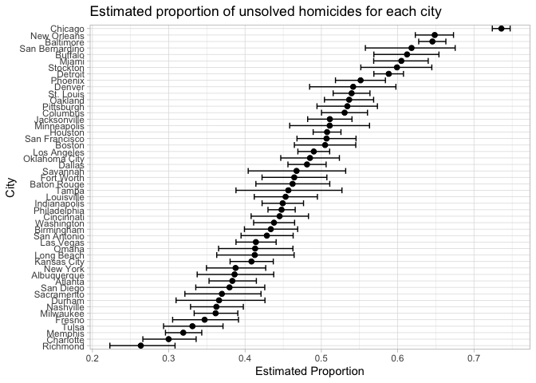
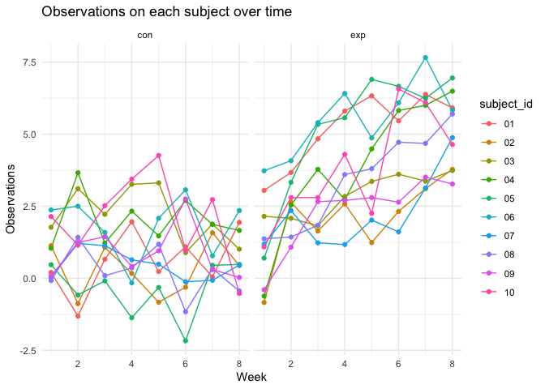
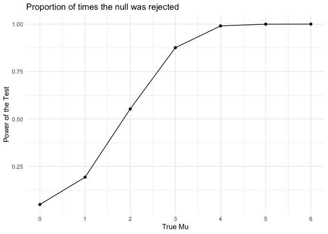
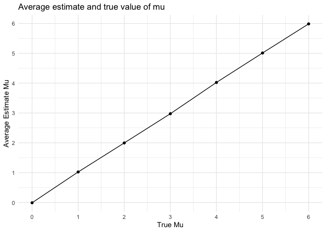
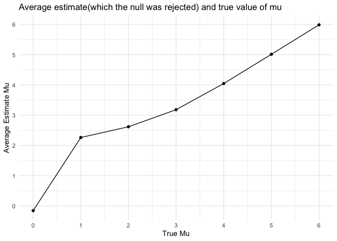

P8105_hw5_yw4200
================
yh
2023-11-04

## Problem 1

The Washington Post has gathered data on homicides in 50 large U.S.
cities and made the data available through a GitHub repository here. You
can read their accompanying article here.

Describe the raw data. Create a city_state variable (e.g. “Baltimore,
MD”) and then summarize within cities to obtain the total number of
homicides and the number of unsolved homicides (those for which the
disposition is “Closed without arrest” or “Open/No arrest”).

``` r
library(dplyr)
```

    ## 
    ## Attaching package: 'dplyr'

    ## The following objects are masked from 'package:stats':
    ## 
    ##     filter, lag

    ## The following objects are masked from 'package:base':
    ## 
    ##     intersect, setdiff, setequal, union

``` r
# import and summarize dataset
homicide <- read.csv("./local_data/homicide-data.csv")
summary(homicide)
```

    ##      uid            reported_date       victim_last        victim_first      
    ##  Length:52179       Min.   : 20070101   Length:52179       Length:52179      
    ##  Class :character   1st Qu.: 20100318   Class :character   Class :character  
    ##  Mode  :character   Median : 20121216   Mode  :character   Mode  :character  
    ##                     Mean   : 20130899                                        
    ##                     3rd Qu.: 20150911                                        
    ##                     Max.   :201511105                                        
    ##                                                                              
    ##  victim_race         victim_age         victim_sex            city          
    ##  Length:52179       Length:52179       Length:52179       Length:52179      
    ##  Class :character   Class :character   Class :character   Class :character  
    ##  Mode  :character   Mode  :character   Mode  :character   Mode  :character  
    ##                                                                             
    ##                                                                             
    ##                                                                             
    ##                                                                             
    ##     state                lat             lon          disposition       
    ##  Length:52179       Min.   :25.73   Min.   :-122.51   Length:52179      
    ##  Class :character   1st Qu.:33.77   1st Qu.: -96.00   Class :character  
    ##  Mode  :character   Median :38.52   Median : -87.71   Mode  :character  
    ##                     Mean   :37.03   Mean   : -91.47                     
    ##                     3rd Qu.:40.03   3rd Qu.: -81.76                     
    ##                     Max.   :45.05   Max.   : -71.01                     
    ##                     NA's   :60      NA's   :60

``` r
# create a city_state variable
# I found that Tulsa corresponds to two states in the dataset, so delete the wrong one.
homicide_add <- homicide |>
  filter(!(city == "Tulsa" & state == "AL")) |>
  mutate(city_state = paste(city, state, sep = ", ")) 
head(homicide_add)
```

    ##          uid reported_date victim_last victim_first victim_race victim_age
    ## 1 Alb-000001      20100504      GARCIA         JUAN    Hispanic         78
    ## 2 Alb-000002      20100216     MONTOYA      CAMERON    Hispanic         17
    ## 3 Alb-000003      20100601 SATTERFIELD      VIVIANA       White         15
    ## 4 Alb-000004      20100101    MENDIOLA       CARLOS    Hispanic         32
    ## 5 Alb-000005      20100102        MULA       VIVIAN       White         72
    ## 6 Alb-000006      20100126        BOOK    GERALDINE       White         91
    ##   victim_sex        city state      lat       lon           disposition
    ## 1       Male Albuquerque    NM 35.09579 -106.5386 Closed without arrest
    ## 2       Male Albuquerque    NM 35.05681 -106.7153      Closed by arrest
    ## 3     Female Albuquerque    NM 35.08609 -106.6956 Closed without arrest
    ## 4       Male Albuquerque    NM 35.07849 -106.5561      Closed by arrest
    ## 5     Female Albuquerque    NM 35.13036 -106.5810 Closed without arrest
    ## 6     Female Albuquerque    NM 35.15111 -106.5378        Open/No arrest
    ##        city_state
    ## 1 Albuquerque, NM
    ## 2 Albuquerque, NM
    ## 3 Albuquerque, NM
    ## 4 Albuquerque, NM
    ## 5 Albuquerque, NM
    ## 6 Albuquerque, NM

``` r
# compute the number of homicides within cities
homicide_city <- homicide_add |>
  group_by(city) |>
  summarise(
    total_homicides = n(), 
    unsolved_homicides = sum(disposition %in% c("Closed without arrest", "Open/No arrest"))
    )

homicide_city
```

    ## # A tibble: 50 × 3
    ##    city        total_homicides unsolved_homicides
    ##    <chr>                 <int>              <int>
    ##  1 Albuquerque             378                146
    ##  2 Atlanta                 973                373
    ##  3 Baltimore              2827               1825
    ##  4 Baton Rouge             424                196
    ##  5 Birmingham              800                347
    ##  6 Boston                  614                310
    ##  7 Buffalo                 521                319
    ##  8 Charlotte               687                206
    ##  9 Chicago                5535               4073
    ## 10 Cincinnati              694                309
    ## # ℹ 40 more rows

Description of the raw data:

Over the course of the last ten years, The Washington Post gathered
information on over 52,000 criminal homicides in 50 of the biggest
American cities. The location of the murder, whether an arrest was made,
and, for the most part, the basic demographics of each victim were among
the data. The raw data includes 12 key variables, such as uid,
reported_date, victim_last, victim_first, victim_race, victim_age,
victim_sex, city, state, lat, lon, disposition. And the data has 52179
observations.There are missing values in `lat` and `lon` columns and
“unknown” values in `victim_race`, `victim_age`, `victim_sex`,
`victim_last`, `victim_first`.

For the city of Baltimore, MD, use the prop.test function to estimate
the proportion of homicides that are unsolved; save the output of
prop.test as an R object, apply the broom::tidy to this object and pull
the estimated proportion and confidence intervals from the resulting
tidy dataframe.

``` r
library(broom)
# filter the dataset
balt_data <- homicide_add |>
  filter(city_state == "Baltimore, MD")

# use the prop.test to estimate the proportion of homicides that are unsolved
proptest_result <-
  prop.test(
    sum(balt_data$disposition %in% c("Closed without arrest", "Open/No arrest")),
    length(balt_data$disposition),
    conf.level = 0.95
)

tidy_result <- tidy(proptest_result)


# pull the estimated proportion and confidence intervals
paste("estimated proportion =", pull(tidy_result,estimate))
```

    ## [1] "estimated proportion = 0.645560665015918"

``` r
paste("confidence intervals =", "[", pull(tidy_result, conf.low), pull(tidy_result, conf.high), "]")
```

    ## [1] "confidence intervals = [ 0.627562457662644 0.663159860401662 ]"

Now run prop.test for each of the cities in your dataset, and extract
both the proportion of unsolved homicides and the confidence interval
for each. Do this within a “tidy” pipeline, making use of purrr::map,
purrr::map2, list columns and unnest as necessary to create a tidy
dataframe with estimated proportions and CIs for each city.

``` r
library(purrr)
library(tidyr)
# create a prop.test function for cities
proptest_city <- function(city,data) {
  proptest_result <- prop.test(
    sum(data$disposition %in% c("Closed without arrest", "Open/No arrest")),
    length(data$disposition),
    conf.level = 0.95
  )
  tidy_result <- tidy(proptest_result)
  tidy_result$city <- city
  return(tidy_result)
}

# nest the information except city and state
homicide_nest <- homicide_add |>
  select(city,everything()) |> 
  nest(others = uid:disposition)

# use map2 function to prop.test each city
results_list <- map2(
  homicide_nest$city,
  homicide_nest$others,
  ~proptest_city(.x, .y)
)

combined_results <- map_dfr(results_list, bind_rows) 

# create a tidy dataframe with estimated proportions and CIs
combined_results |> 
  select(city,estimate,conf.low,conf.high) |>
  mutate(CIs = paste0("[",conf.low,",",conf.high, "]"))
```

    ## # A tibble: 50 × 5
    ##    city        estimate conf.low conf.high CIs                                  
    ##    <chr>          <dbl>    <dbl>     <dbl> <chr>                                
    ##  1 Albuquerque    0.386    0.337     0.438 [0.337260384254284,0.437576606555521]
    ##  2 Atlanta        0.383    0.353     0.415 [0.352811897036302,0.414821883953622]
    ##  3 Baltimore      0.646    0.628     0.663 [0.627562457662644,0.663159860401662]
    ##  4 Baton Rouge    0.462    0.414     0.511 [0.414198741860307,0.511023960018796]
    ##  5 Birmingham     0.434    0.399     0.469 [0.399188948632167,0.468955748189036]
    ##  6 Boston         0.505    0.465     0.545 [0.464621930200304,0.545088051772638]
    ##  7 Buffalo        0.612    0.569     0.654 [0.568798964634228,0.654087939253532]
    ##  8 Charlotte      0.300    0.266     0.336 [0.26608198188312,0.335899860867845] 
    ##  9 Chicago        0.736    0.724     0.747 [0.723995888425454,0.747399787306647]
    ## 10 Cincinnati     0.445    0.408     0.483 [0.407960574220688,0.483143880618937]
    ## # ℹ 40 more rows

Create a plot that shows the estimates and CIs for each city – check out
geom_errorbar for a way to add error bars based on the upper and lower
limits. Organize cities according to the proportion of unsolved
homicides.

``` r
# Create a plot that shows the estimates and CIs for each city
library(ggplot2)

ggplot(combined_results, aes(group = city, y = reorder(city, estimate))) +
  geom_point(aes(x = estimate), size = 2) +
  geom_errorbar(aes(xmin = conf.low, xmax = conf.high)) +
  labs(title = "Estimated proportion of unsolved homicides for each city",
       x = "Estimated Proportion",
       y = "City") +
  theme_light()
```

<!-- -->

## Problem 2

This zip file contains data from a longitudinal study that included a
control arm and an experimental arm. Data for each participant is
included in a separate file, and file names include the subject ID and
arm.

Create a tidy dataframe containing data from all participants, including
the subject ID, arm, and observations over time:

Start with a dataframe containing all file names; the list.files
function will help

Iterate over file names and read in data for each subject using
purrr::map and saving the result as a new variable in the dataframe

Tidy the result; manipulate file names to include control arm and
subject ID, make sure weekly observations are “tidy”, and do any other
tidying that’s necessary

``` r
library(readr)
# import data use function
import_data = function(x) {
  read_csv(x) |>
  mutate(filename = x)
}

conexp_list = list.files("./local_data/problem2_data", pattern = "\\.csv$", full.names = T)

conexp_df = map(conexp_list, import_data)
```

    ## Rows: 1 Columns: 8
    ## ── Column specification ────────────────────────────────────────────────────────
    ## Delimiter: ","
    ## dbl (8): week_1, week_2, week_3, week_4, week_5, week_6, week_7, week_8
    ## 
    ## ℹ Use `spec()` to retrieve the full column specification for this data.
    ## ℹ Specify the column types or set `show_col_types = FALSE` to quiet this message.
    ## Rows: 1 Columns: 8
    ## ── Column specification ────────────────────────────────────────────────────────
    ## Delimiter: ","
    ## dbl (8): week_1, week_2, week_3, week_4, week_5, week_6, week_7, week_8
    ## 
    ## ℹ Use `spec()` to retrieve the full column specification for this data.
    ## ℹ Specify the column types or set `show_col_types = FALSE` to quiet this message.
    ## Rows: 1 Columns: 8
    ## ── Column specification ────────────────────────────────────────────────────────
    ## Delimiter: ","
    ## dbl (8): week_1, week_2, week_3, week_4, week_5, week_6, week_7, week_8
    ## 
    ## ℹ Use `spec()` to retrieve the full column specification for this data.
    ## ℹ Specify the column types or set `show_col_types = FALSE` to quiet this message.
    ## Rows: 1 Columns: 8
    ## ── Column specification ────────────────────────────────────────────────────────
    ## Delimiter: ","
    ## dbl (8): week_1, week_2, week_3, week_4, week_5, week_6, week_7, week_8
    ## 
    ## ℹ Use `spec()` to retrieve the full column specification for this data.
    ## ℹ Specify the column types or set `show_col_types = FALSE` to quiet this message.
    ## Rows: 1 Columns: 8
    ## ── Column specification ────────────────────────────────────────────────────────
    ## Delimiter: ","
    ## dbl (8): week_1, week_2, week_3, week_4, week_5, week_6, week_7, week_8
    ## 
    ## ℹ Use `spec()` to retrieve the full column specification for this data.
    ## ℹ Specify the column types or set `show_col_types = FALSE` to quiet this message.
    ## Rows: 1 Columns: 8
    ## ── Column specification ────────────────────────────────────────────────────────
    ## Delimiter: ","
    ## dbl (8): week_1, week_2, week_3, week_4, week_5, week_6, week_7, week_8
    ## 
    ## ℹ Use `spec()` to retrieve the full column specification for this data.
    ## ℹ Specify the column types or set `show_col_types = FALSE` to quiet this message.
    ## Rows: 1 Columns: 8
    ## ── Column specification ────────────────────────────────────────────────────────
    ## Delimiter: ","
    ## dbl (8): week_1, week_2, week_3, week_4, week_5, week_6, week_7, week_8
    ## 
    ## ℹ Use `spec()` to retrieve the full column specification for this data.
    ## ℹ Specify the column types or set `show_col_types = FALSE` to quiet this message.
    ## Rows: 1 Columns: 8
    ## ── Column specification ────────────────────────────────────────────────────────
    ## Delimiter: ","
    ## dbl (8): week_1, week_2, week_3, week_4, week_5, week_6, week_7, week_8
    ## 
    ## ℹ Use `spec()` to retrieve the full column specification for this data.
    ## ℹ Specify the column types or set `show_col_types = FALSE` to quiet this message.
    ## Rows: 1 Columns: 8
    ## ── Column specification ────────────────────────────────────────────────────────
    ## Delimiter: ","
    ## dbl (8): week_1, week_2, week_3, week_4, week_5, week_6, week_7, week_8
    ## 
    ## ℹ Use `spec()` to retrieve the full column specification for this data.
    ## ℹ Specify the column types or set `show_col_types = FALSE` to quiet this message.
    ## Rows: 1 Columns: 8
    ## ── Column specification ────────────────────────────────────────────────────────
    ## Delimiter: ","
    ## dbl (8): week_1, week_2, week_3, week_4, week_5, week_6, week_7, week_8
    ## 
    ## ℹ Use `spec()` to retrieve the full column specification for this data.
    ## ℹ Specify the column types or set `show_col_types = FALSE` to quiet this message.
    ## Rows: 1 Columns: 8
    ## ── Column specification ────────────────────────────────────────────────────────
    ## Delimiter: ","
    ## dbl (8): week_1, week_2, week_3, week_4, week_5, week_6, week_7, week_8
    ## 
    ## ℹ Use `spec()` to retrieve the full column specification for this data.
    ## ℹ Specify the column types or set `show_col_types = FALSE` to quiet this message.
    ## Rows: 1 Columns: 8
    ## ── Column specification ────────────────────────────────────────────────────────
    ## Delimiter: ","
    ## dbl (8): week_1, week_2, week_3, week_4, week_5, week_6, week_7, week_8
    ## 
    ## ℹ Use `spec()` to retrieve the full column specification for this data.
    ## ℹ Specify the column types or set `show_col_types = FALSE` to quiet this message.
    ## Rows: 1 Columns: 8
    ## ── Column specification ────────────────────────────────────────────────────────
    ## Delimiter: ","
    ## dbl (8): week_1, week_2, week_3, week_4, week_5, week_6, week_7, week_8
    ## 
    ## ℹ Use `spec()` to retrieve the full column specification for this data.
    ## ℹ Specify the column types or set `show_col_types = FALSE` to quiet this message.
    ## Rows: 1 Columns: 8
    ## ── Column specification ────────────────────────────────────────────────────────
    ## Delimiter: ","
    ## dbl (8): week_1, week_2, week_3, week_4, week_5, week_6, week_7, week_8
    ## 
    ## ℹ Use `spec()` to retrieve the full column specification for this data.
    ## ℹ Specify the column types or set `show_col_types = FALSE` to quiet this message.
    ## Rows: 1 Columns: 8
    ## ── Column specification ────────────────────────────────────────────────────────
    ## Delimiter: ","
    ## dbl (8): week_1, week_2, week_3, week_4, week_5, week_6, week_7, week_8
    ## 
    ## ℹ Use `spec()` to retrieve the full column specification for this data.
    ## ℹ Specify the column types or set `show_col_types = FALSE` to quiet this message.
    ## Rows: 1 Columns: 8
    ## ── Column specification ────────────────────────────────────────────────────────
    ## Delimiter: ","
    ## dbl (8): week_1, week_2, week_3, week_4, week_5, week_6, week_7, week_8
    ## 
    ## ℹ Use `spec()` to retrieve the full column specification for this data.
    ## ℹ Specify the column types or set `show_col_types = FALSE` to quiet this message.
    ## Rows: 1 Columns: 8
    ## ── Column specification ────────────────────────────────────────────────────────
    ## Delimiter: ","
    ## dbl (8): week_1, week_2, week_3, week_4, week_5, week_6, week_7, week_8
    ## 
    ## ℹ Use `spec()` to retrieve the full column specification for this data.
    ## ℹ Specify the column types or set `show_col_types = FALSE` to quiet this message.
    ## Rows: 1 Columns: 8
    ## ── Column specification ────────────────────────────────────────────────────────
    ## Delimiter: ","
    ## dbl (8): week_1, week_2, week_3, week_4, week_5, week_6, week_7, week_8
    ## 
    ## ℹ Use `spec()` to retrieve the full column specification for this data.
    ## ℹ Specify the column types or set `show_col_types = FALSE` to quiet this message.
    ## Rows: 1 Columns: 8
    ## ── Column specification ────────────────────────────────────────────────────────
    ## Delimiter: ","
    ## dbl (8): week_1, week_2, week_3, week_4, week_5, week_6, week_7, week_8
    ## 
    ## ℹ Use `spec()` to retrieve the full column specification for this data.
    ## ℹ Specify the column types or set `show_col_types = FALSE` to quiet this message.
    ## Rows: 1 Columns: 8
    ## ── Column specification ────────────────────────────────────────────────────────
    ## Delimiter: ","
    ## dbl (8): week_1, week_2, week_3, week_4, week_5, week_6, week_7, week_8
    ## 
    ## ℹ Use `spec()` to retrieve the full column specification for this data.
    ## ℹ Specify the column types or set `show_col_types = FALSE` to quiet this message.

``` r
conexp_data = bind_rows(conexp_df)
summary(conexp_data)
```

    ##      week_1            week_2           week_3           week_4       
    ##  Min.   :-0.8400   Min.   :-1.310   Min.   :-0.090   Min.   :-1.3700  
    ##  1st Qu.: 0.0675   1st Qu.: 1.195   1st Qu.: 1.198   1st Qu.: 0.5825  
    ##  Median : 1.0650   Median : 2.215   Median : 1.730   Median : 2.6400  
    ##  Mean   : 1.0280   Mean   : 1.875   Mean   : 2.160   Mean   : 2.4370  
    ##  3rd Qu.: 1.8625   3rd Qu.: 2.877   3rd Qu.: 2.695   3rd Qu.: 3.4800  
    ##  Max.   : 3.7300   Max.   : 4.080   Max.   : 5.400   Max.   : 6.4100  
    ##      week_5           week_6           week_7            week_8      
    ##  Min.   :-0.830   Min.   :-2.170   Min.   :-0.0700   Min.   :-0.530  
    ##  1st Qu.: 1.123   1st Qu.: 0.950   1st Qu.: 0.6975   1st Qu.: 0.475  
    ##  Median : 2.165   Median : 2.670   Median : 2.9200   Median : 2.810  
    ##  Mean   : 2.544   Mean   : 2.660   Mean   : 3.0035   Mean   : 2.929  
    ##  3rd Qu.: 3.915   3rd Qu.: 4.905   3rd Qu.: 5.0100   3rd Qu.: 5.085  
    ##  Max.   : 6.900   Max.   : 6.660   Max.   : 7.6600   Max.   : 6.950  
    ##    filename        
    ##  Length:20         
    ##  Class :character  
    ##  Mode  :character  
    ##                    
    ##                    
    ## 

``` r
# tidy the data and make it readable
conexp_clean <- conexp_data |>
  mutate(
    subject_id = substr(conexp_list, 32, 33),
    group = substr(conexp_list, 28, 30),
    ) |>
  pivot_longer(
    week_1:week_8,
    names_to = "week",
    names_prefix = "week_",
    values_to = "observations"
  ) |>
  mutate(week = as.numeric(week)) |>
  select(subject_id,group,everything(),-filename)

head(conexp_clean)
```

    ## # A tibble: 6 × 4
    ##   subject_id group  week observations
    ##   <chr>      <chr> <dbl>        <dbl>
    ## 1 01         con       1         0.2 
    ## 2 01         con       2        -1.31
    ## 3 01         con       3         0.66
    ## 4 01         con       4         1.96
    ## 5 01         con       5         0.23
    ## 6 01         con       6         1.09

Make a spaghetti plot showing observations on each subject over time,
and comment on differences between groups.

``` r
# make a spaghetti plot
conexp_plot <- conexp_clean |>
  ggplot(aes(x = week, y = observations, color = subject_id, group = subject_id)) +
  geom_line() +
  geom_point() +
  facet_grid(~ group) +
  labs(title = "Observations on each subject over time",
       x = "Week",
       y = "Observations") +
  theme_minimal()

conexp_plot
```

<!-- -->
Comments:

The experimental group’s subjects have higher observations over time
than the control group’s subjects. The observations of experimental
group has an increasing trend as the week goes on, while the
observations of control group stay stable as the week goes on.

Problem 3 When designing an experiment or analysis, a common question is
whether it is likely that a true effect will be detected – put
differently, whether a false null hypothesis will be rejected. The
probability that a false null hypothesis is rejected is referred to as
power, and it depends on several factors, including: the sample size;
the effect size; and the error variance. In this problem, you will
conduct a simulation to explore power in a one-sample t-test.

First set the following design elements:

Fix n=30

Fix σ=5

Set μ=0

Generate 5000 datasets from the model x∼Normal\[μ,σ\]

For each dataset, save μ̂ and the p-value arising from a test of H:μ=0,
using α=0.05. Hint: to obtain the estimate and p-value, use broom::tidy
to clean the output of t.test.

``` r
# define a function to compute t.test
t_test = function(n = 30, mu = 0, sigma = 5) {
  
  test_data = tibble(
    x = rnorm(n, mean = mu, sd = sigma),
  )
  
  broom::tidy(t.test(test_data, mu = mu, alternative = "two.sided",conf.level = 0.95))
 
}

# Generate 5000 datasets
results_df = 
  expand_grid(
    sample_size = 30,
    iter = 1:5000
  ) |> 
  mutate(
    estimate_df = map(sample_size, t_test)
  ) |> 
  unnest(estimate_df)

# print the result
results_df |>
  select(estimate, p.value)
```

    ## # A tibble: 5,000 × 2
    ##    estimate p.value
    ##       <dbl>   <dbl>
    ##  1    0.645  0.377 
    ##  2   -0.791  0.371 
    ##  3   -2.06   0.0308
    ##  4    1.16   0.147 
    ##  5   -0.328  0.784 
    ##  6   -1.39   0.121 
    ##  7    0.705  0.374 
    ##  8   -0.935  0.355 
    ##  9   -0.226  0.791 
    ## 10    1.63   0.0749
    ## # ℹ 4,990 more rows

``` r
results_df1 <- results_df |>
  mutate(true_mu = 0)
```

Repeat the above for μ={1,2,3,4,5,6}, and complete the following:

``` r
# create a new function related to mu
t_test2 = function(mu, sigma = 5) {
  sim_data <- tibble(
    x = rnorm(30, mean = mu, sd = sigma)
    )
  broom::tidy(t.test(sim_data))

}

results_df2 = 
  expand_grid(
    true_mu = c(1,2,3,4,5,6),
    iter = 1:5000
  ) |> 
  mutate(
    estimate_df = map(true_mu, t_test2)
  ) |> 
  unnest(estimate_df) 

result_combine = bind_rows(results_df1,results_df2)

head(result_combine)
```

    ## # A tibble: 6 × 11
    ##   sample_size  iter estimate statistic p.value parameter conf.low conf.high
    ##         <dbl> <int>    <dbl>     <dbl>   <dbl>     <dbl>    <dbl>     <dbl>
    ## 1          30     1    0.645     0.898  0.377         29   -0.825     2.12 
    ## 2          30     2   -0.791    -0.909  0.371         29   -2.57      0.990
    ## 3          30     3   -2.06     -2.27   0.0308        29   -3.91     -0.204
    ## 4          30     4    1.16      1.49   0.147         29   -0.432     2.76 
    ## 5          30     5   -0.328    -0.276  0.784         29   -2.76      2.10 
    ## 6          30     6   -1.39     -1.60   0.121         29   -3.17      0.389
    ## # ℹ 3 more variables: method <chr>, alternative <chr>, true_mu <dbl>

Make a plot showing the proportion of times the null was rejected (the
power of the test) on the y axis and the true value of μ on the x axis.
Describe the association between effect size and power.

``` r
reject_plot <- result_combine |>
  group_by(true_mu) |>
  summarize(estimate = mean(estimate), power = mean(p.value < 0.05)) |>
  ggplot(aes(x = true_mu,y = power)) +
  geom_point() +
  geom_line() +
  scale_x_continuous(breaks = seq(0,6)) +
  labs(x = "True Mu",y = "Power of the Test",title = "Proportion of times the null was rejected") +
  theme_minimal()

reject_plot
```

<!-- -->
Description:

It is expected that the power of the test will increase in association
with the effect size, which is the difference between the true μ and the
null hypothesis value. In other words, a larger effect means that the
test can detect it more accurately.

Make a plot showing the average estimate of μ̂ on the y axis and the true
value of μ on the x axis. Make a second plot (or overlay on the first)
the average estimate of μ̂ only in samples for which the null was
rejected on the y axis and the true value of μ on the x axis. Is the
sample average of μ̂ across tests for which the null is rejected
approximately equal to the true value of μ? Why or why not?

``` r
# a plot showing the average estimate and the true value of mu
estimate_mu = result_combine |>
  group_by(true_mu) |>
  summarise(avg_estimate = mean(estimate))

mu_plot <- estimate_mu |>
  ggplot(aes(x = true_mu, y = avg_estimate)) +
  geom_point() +
  geom_line() +
  labs(x = "True Mu",y = "Average Estimate Mu",title = "Average estimate and true value of mu") +
  scale_x_continuous(breaks = seq(0,6)) + 
  scale_y_continuous(breaks = seq(0,6)) + 
  theme_minimal()

mu_plot
```

<!-- -->

``` r
# a second plot for the average estimate of mu which the null was rejected and the true value of mu
reject_mu = result_combine |>
  filter(p.value < 0.05) |>
  group_by(true_mu) |>
  summarise(avg_estimate = mean(estimate))

reject_mu_plot <- reject_mu |>
  ggplot(aes(x = true_mu, y = avg_estimate)) +
  geom_point() +
  geom_line() +
  labs(x = "True Mu",y = "Average Estimate Mu",title = "Average estimate(which the null was rejected) and true value of mu") +
  scale_x_continuous(breaks = seq(0,6)) + 
  scale_y_continuous(breaks = seq(0,6)) + 
  theme_minimal()

reject_mu_plot
```

<!-- -->
The sample average of mu across tests for which the null is rejected
approximately equal to the true value of mu.

The average estimate means of whose null are rejected differ from the
true mean when the true mean is small(1-3). This could be as a result of
the low power at low effect size. The average estimate means of whose
null are rejected are similar to the true mean when the true mean is
greater than 3.The samples were randomly selected from the distribution
x∼Normal\[μ,σ\]. When the number of samples is large enough and null
rejected samples, their mean distribution tends to be approximately
symmetric to the true μ due to the randomness.
